#1. Version Description
 The mlaser version is V2.3

#2. Release Note

## V2.3
  1.fix the issue that some English interface is displayed in Chinese.

  2.fix some spelling mistakes.

  3.fix Png image processing exception.

  4.when switch the "Scale unit", The scale does not follow the switch.

  5.fix The "Disconnect" function of the serial port.

  6.click the open file button, the interface of the original picture will be cleared away.

  7.for add Text function, the font size does not match the real size.

  8.Keyboard direction key changed as design requirements.

## V2.2
  1.fix the issue that unexpectedly prints the anchor point

  2.Modify the code to generate the MAC application

## V2.1
  1.fix part of the Chinese-English Translation

  2.fix the display of QR code

  3.fix Gcode mode function

## V2.0
  1.Organize the code structure, the first open source in the git

#3. Revision of history
|Author      |       Time      |   Version    |    Descr     |
| --------   |      :-----:    |   :----:     |    :-----    |
|happybird   |     2016/08/07  |   V1.0       |    Initial commit.|
|happybird   |     2016/10/25  |   V2.0       |    open source release in git|
|wangleilei  |     2016/10/31  |   V2.1       |    fix JIRA issue MLAS-1.MLAS-2,MLAS-3.|
|wangleilei  |     2016/11/11  |   V2.2       |    fix the issue that unexpectedly prints the anchor point|
|Mark Yan    |     2016/12/12  |   V2.3       |    fix some issue|

#4. Official website
Learn more from Makeblock official website
[http://learn.makeblock.com/en/laserbot/](http://learn.makeblock.com/en/laserbot/)

#5. Detailed instructions of mLaser
## (1) Software installation

Click to download the installation of the compressed package

|Version    |System     |DownLoad from Git|DownLoad from Makeblock|
|:----      |:----      |:----            |:----                  |
|V2.3       |Mac OS     |[Download Link 1](https://raw.githubusercontent.com/Makeblock-official/mlaser_resources/master/distribution/mac/mLaser.dmg)|[Download Link 2](http://download.makeblock.com/laserbot/mLaser.dmg)|
|V2.3       |Windows    |[Download Link 1](https://raw.githubusercontent.com/Makeblock-official/mlaser_resources/master/distribution/windows/mLaserSetup.rar)|[Download Link 2](http://download.makeblock.com/laserbot/mLaserSetup.rar)|

Then follow the instructions to install it. (Note: Please use English characters in the installation address.)

## (2) Software configuration

(*This step is necessary for the first use of LaserBot, and later you may directly skip to step 1*)
After assembling LaserBot, start mLaser to access the log in interface:

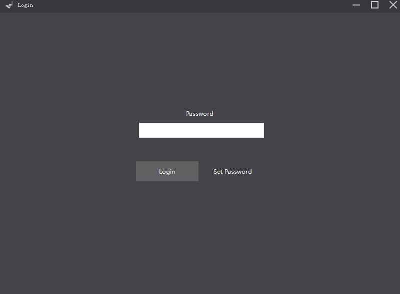

Default login password: 123  (*click “set password” on the right to set your own password*)

Supervisor password: makeblock321  (*using supervisor password when you forget your own password*)

Click “Login” to access the lower-layer interface:

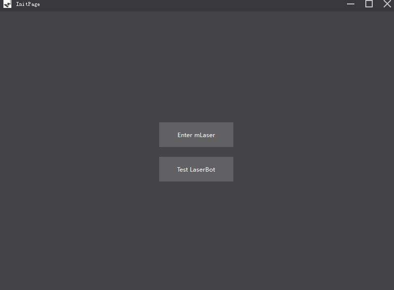

Click “Test LaserBot” to access the interface as shown below:

Click “Update Firmware” , you will see as follow:

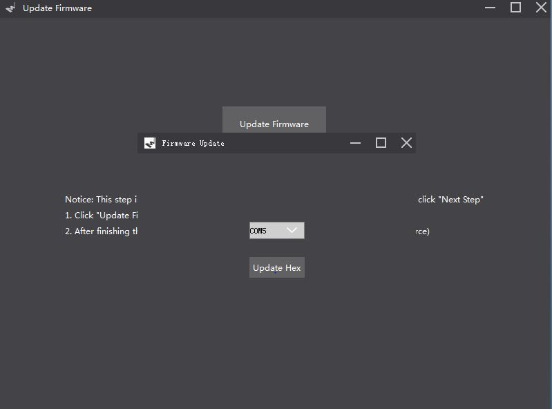

Select the serial port of the computer which connected to LaserBot (If there are multiple serial devices in the computer, you need to find the serial interface number corresponding to the MegaPi in the device manager. The serial port number of the computer connected to the MegaPi is COM5 in this Manual).

Click “Update Hex” , you will see a note as follow:

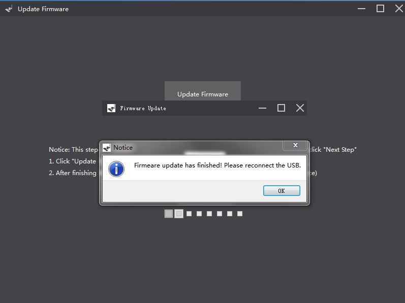

Click “OK” , mLaser will automatically exit and then you need to reconnect USB.

Reopen mLaser. Type your password to access the lower-layer interface:

Click “Test LaserBot” to enter the interface as shown below:

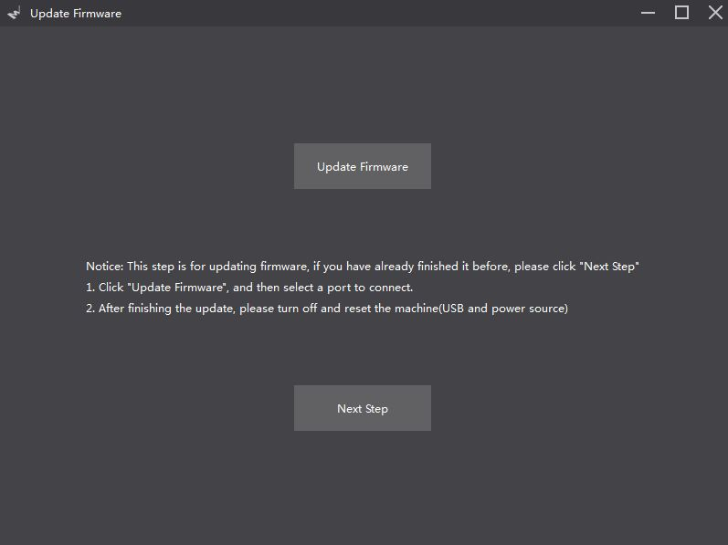

Click “Next Step” to enter the interface as shown below:

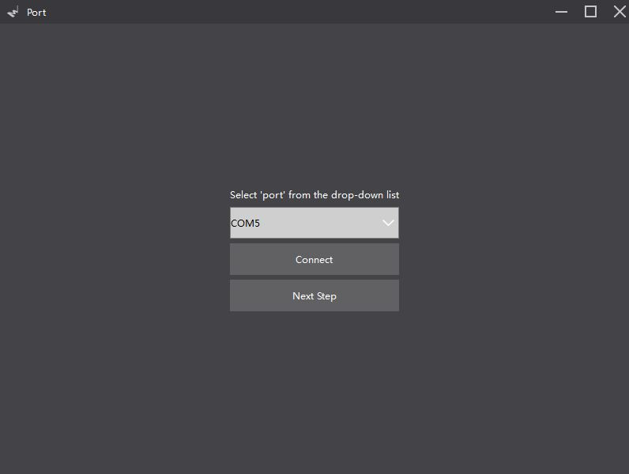

Select the serial port of the computer connected to LaserBot (If there are multiple serial devices in the computer, the user may look for the serial interface number corresponding to the MegaPi in the device manager. The serial port number of the computer connected to the MegaPi is COM5 in this Manual) , then click “Connect”. Upon a successful connection, a prompt in the following figure is displayed:

Click “OK” and then click “Next Step” to enter the interface as shown below:

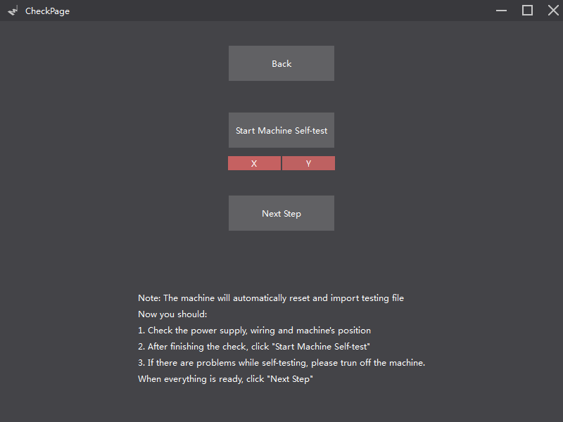

Follow the procedures shown on the interface:

1) Check the power supply, wiring and machine’s position.

2) After touching the limit switch of X axis for 2 seconds, the icon “X” turns green (as shown below); after touching the limit switch of Y axis for 2 seconds, the icon “Y” turns green (as shown below):

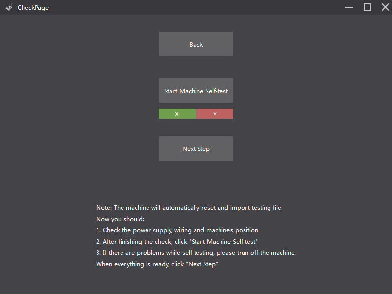

After checking all the things of LaserBot , click “Start Machine Self-test”

Follow the procedures shown on the interface and click “Next Step” to enter the interface as shown below:

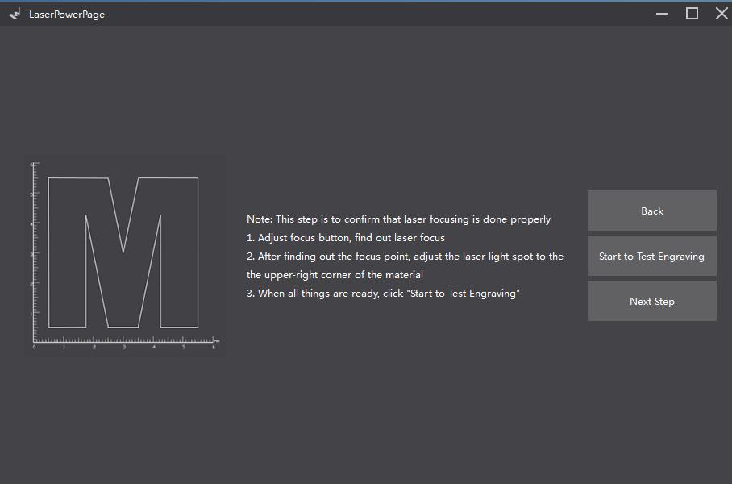

Put the board under the laser head, then put on the protective goggles, click “Start to Test Engraving”. LaserBot will begin to carry out laser engraving according to the default procedures .(the picture shown below).
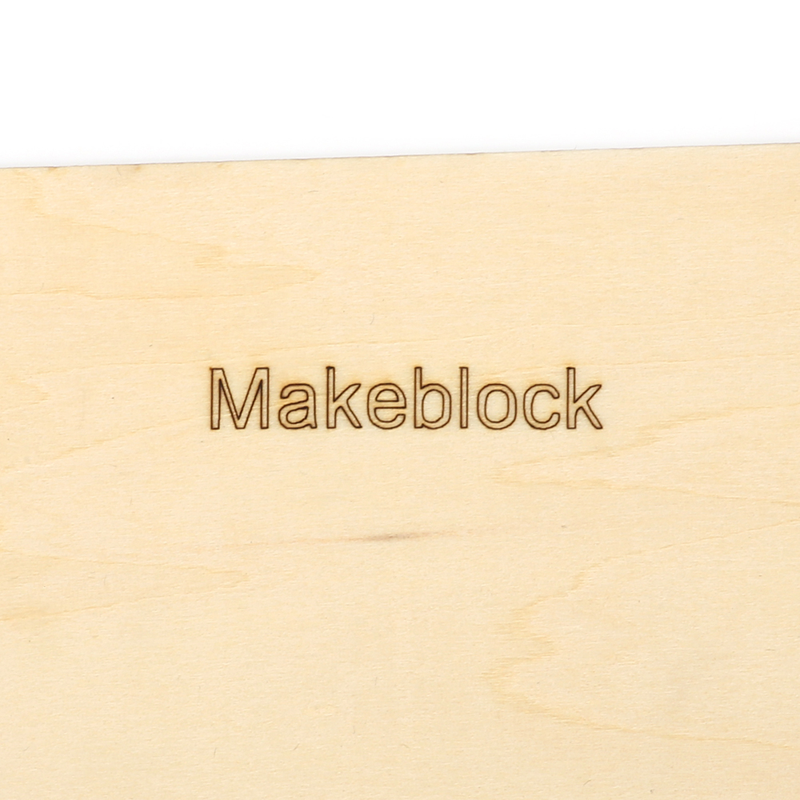

Upon completion, an interface in the following figure is displayed:

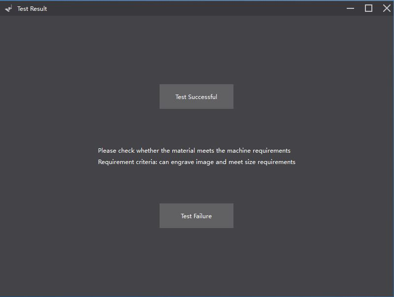

（*Step 0 is only necessary for the first use of mLaser, user can start with step 1 for the later use!*）

Click “Enter mLaser” for Use after Ensuring Proper Installation

mLaser provides two control modes: “Simple Mode” and “Expert Mode”. The simple mode only allows LaserBot to engrave with default parameters. The interface of the simple mode is shown in the following figure:

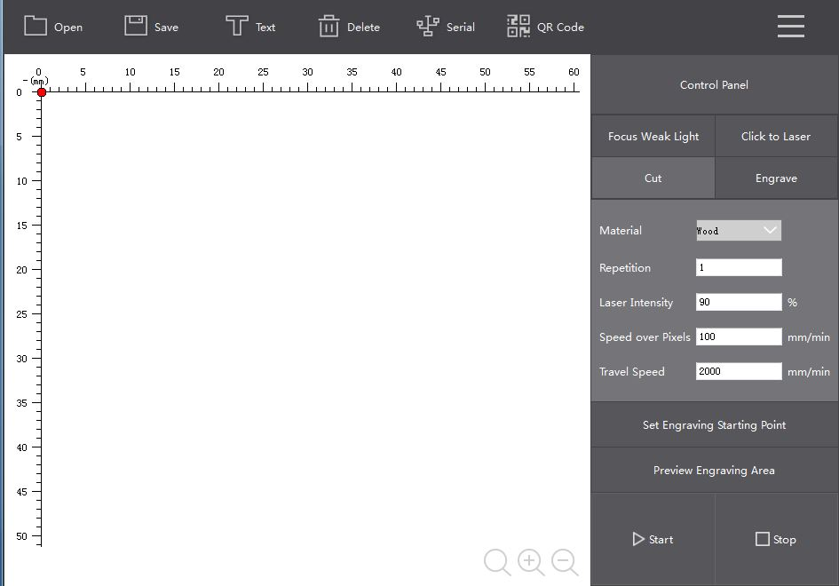

You can switch between the “Expert Mode” and the “Simple Mode” by selecting the mode in the “Select Interface” on the pull-down menu.

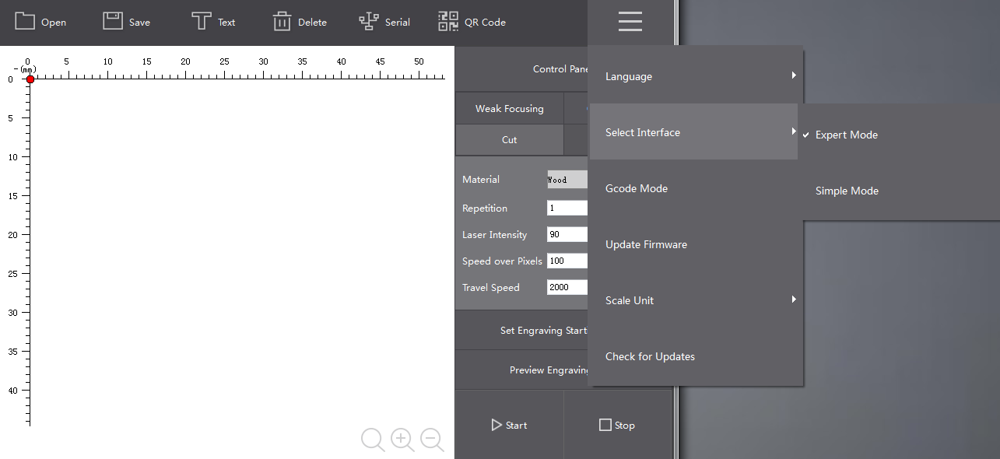
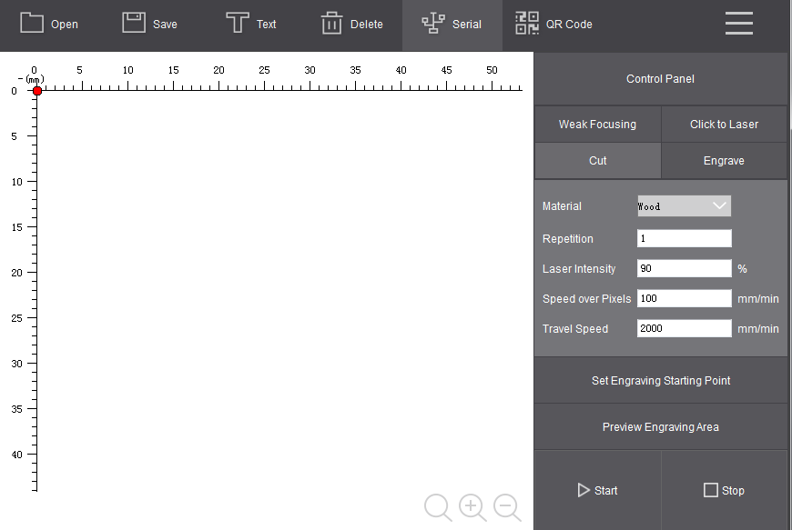

(*Note: Instructions are given for the expert mode only.*)