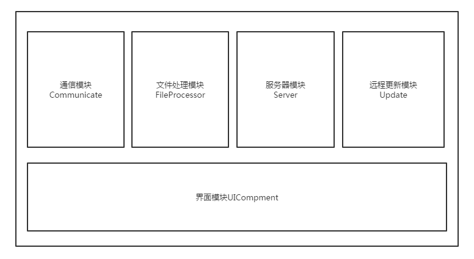
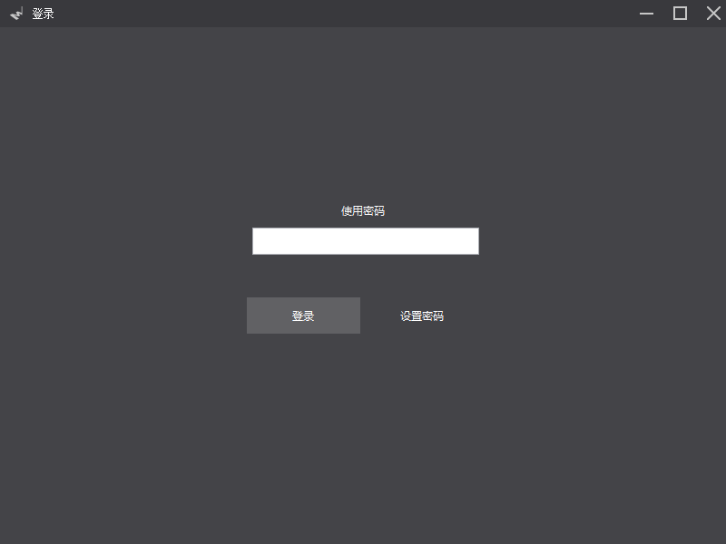
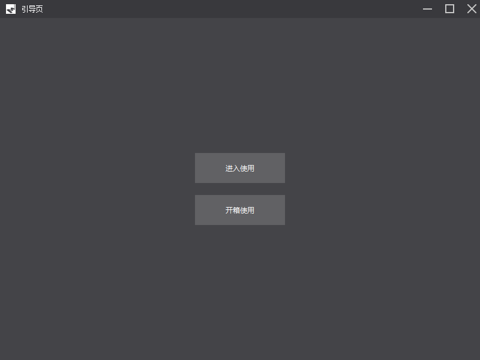
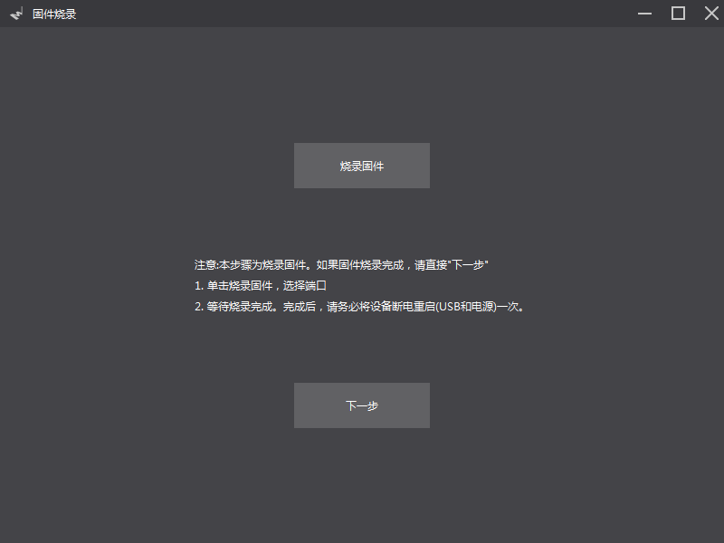
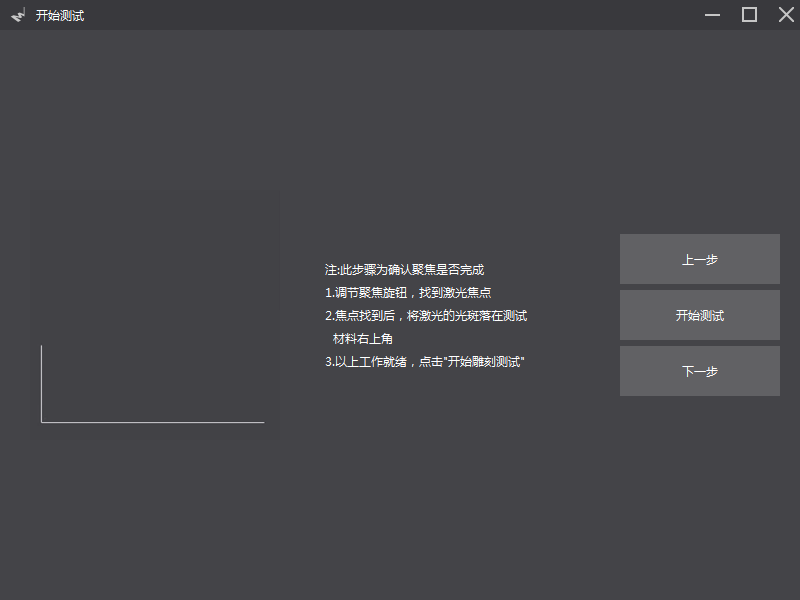

# mLaser1.x 软件上位机开发手册

## 目录

### 1. 概述
#### 1.1 开发背景
	
mLaser1.x是针对当前的LaserBot开展的一个项目，同时，也是为未来的桌面激光雕刻机做软件积累。mLaser1.x版本，目前主要核心代码是文件数据处理代码以及服务器框架代码。

- 1. 文件数据处理

 文件数据处理是后面很多产品均可使用到的模块，可以大大降低用户使用激光雕刻机的门槛。它主要实现将各种不同的图片转换成最终下位机能够识别的Gcode。同时，文件数据处理还担当着应用扩展的作用，当需要对雕刻实现不同的效果(人脸转卡通等)时，均需要通过该模块实现。

- 2. 服务器框架

  服务器框架为未来设备向web/移动端提供了基础。
  首先，服务器框架依然使用的是C++/Qt实现，有非常不错的跨平台性(尤其是在嵌入式系统)，可以方便集成在树莓派，香蕉派等一些系统中。
  回到mLaser1.x，服务器端目前提供主要是框架，能够实现绝大部分的网页访问情景。在mLaser1.x中，我们实现了二维码访问，远程更新下载软件模块(目前无法支持下载后自动安装部署，可朝该方向发展)。  mLaser1.x的服务器框架主要是针对小型局域网络。这是目前存在的局限性。未来，可以在该框架上加入同云端服务器交互的部分，实现更大的功能。

#### 1.2 总体框架
下面是mLaser1.x的框架总体框架图:

在工程代码中，各个模块均有对应的文件夹。如下图:

这些模块的作用分别如下:

- 通信模块: 提供串口读写操作函数，包含对应的抽象类，便于扩展其他通信方式

- 文件处理模块: 处理图片，矢量svg，dxf等格式，对gcode数据进行二次处理

- 服务器模块: 提供服务器框架，实现通过web来传输对应的打印文件的功能

- 远程更新模块: 本地软件检测自己的版本号是否与远程服务器版本一致，并给出版本更新提示

- 界面模块: 软件所有的窗口描述 

在第二个章节中将对每一个模块的实现以及实现过程中特别需要注意的地方及进行说明。
    

#### 1.3 开发环境，文件

- Windows下 
网站:http://download.qt.io/official_releases/qt/5.3/5.3.1/

选择版本: qt-opensource-windows-x86-mingw482_opengl-5.3.1.exe

- Linux下
网站:http://download.qt.io/official_releases/qt/5.3/5.3.1/

选择版本:qt-opensource-linux-x86-5.3.1.run

- Mac下
网站: http://download.qt.io/official_releases/qt/5.3/5.3.1/

选择版本:qt-opensource-mac-x64-clang-5.3.1.run

mLaser1.x只依赖上述的安装包，不需要安装其他第三方软件。x64或者x86版本选择，须更具个人的电脑系统来定

公司提供了一系列关于Qt的书籍和教程视屏，可以在公司云盘http://192.168.12.245/电子组视频资料
这个位置找到

### 2. 模块功能以及详细实现

文件转换的数据关系:

#### 2.1 文件转换模块(FileProcessor)

本模块是mLaser中最为核心的模块之一，主要负责各种文件数据之间的转换，路径规划以及数据清理。注意，所有对文件转换模块的调用，均在UI模块中的BD_ViewForm模块中，其他模块均没有对文件转换模块进行调用。

##### 2.1.1 图片转Gcode(bitmap2gcode)

该子模块是负责将一张普通的图片(png，jpg等)，直接输出为Gcode代码。在生成gcode路径之前，需要使用基本的图形处理算法来对图片进行处理。主要可以参考的算法有: 动态阈值，素描效果算法。本模块最终生成的gcode都是以Z字形扫描的形式输出，同时可根据图片的像素深度来规划不同的激光强度。

本子模块对应的代码均在bitmap2gcode目录下，每种算法效果对应了一个函数。调用时，输入为QImage，输出为算法处理后的QImage图片。进入到bitmap2gcode的目录中，查看对应的实现代码。本模块中，主要实现的流程为:

- A. 导入图片，遍历图片，通过函数qGray()将图片转换为0~255的灰度图片

- B. 遍历像素，根据每个像素点的灰度值来产生对应的gcode中的激光强度码。例如:M4 P200指令表示将激光的PWM开至200

- C. 遍历像素的同时，根据从界面中获取到的图片大小和位置，来计算每个像素点之间实际的间隔。最终得到gcode

通过bitmap2gcode模块生成的gcode，都是通过来回扫描图片的像素点来实现激光雕刻的，虽然可以实现由灰度的图片雕刻，但是雕刻速度是非常慢的，每一张图至少要雕刻2小时以上。灰度雕刻花费时间来换取精度效果。

有没有更好的办法来实现既有精度细节，又能保证速度？
我们分析一下为什么灰度打印会非常慢。首先，灰度打印是要区分每一个像素，每打印一个像素向下一个像素转换，电机有加速阶段，但像素与像素之间的距离，一般不会超过1mm，这就导致加速的时间非常短，就进入了下一个加速阶段了，这样，宏观看起来的打印速度依然是非常慢的。如果不用区分每一点，而是将每一点的深浅规划成一样，那是否可以减少电机的加减速次数？

* 不使用灰度雕刻，使用二值化后的图片(或者n值化，将图片的颜色分配到更少的区段，比如只有100的灰度变换)。

* 使用二值化，在二值化的过程中做优化，也就是得到一种保持了图片大量细节的二值化图片

综上两点，要减少打印时间，优化打印的效果，就需要从图片的优化处理上进行优化了。
这里提供几种不同的思路，可以靠对应的算法来实现不同效果的二值化图片：

1. 铅笔画/素描 算法

2. Halftoning算法

3. Voronoi Stippler

上述算法均是将普通图片转换成可以用二值化表示的图片，一旦变成二值化，打印的时间至少可以减少到原来的十分之一。

##### 2.1.2 矢量转Gcode(svg2gcode)
	
本模块是一个过渡模块，凡是进行矢量雕刻，都需要使用到该模块，比如，bitmap变失量图(svg)再转换成gcode需要用到本模块，dxf要转gcode，也是先将dxf转换为svg，再用本模块来将svg转换为gcode。下面主要介绍下模块对应的接口。除去实现细节，所有的接口都在svg2gcodep.cpp这个类文件中。

	void SvgToGcode(QString inputfile,QString outfile);//外部接口，第一个参数是svg路径，第二个参数是gcode的保存路径
	void SetGcoderHeader(QString str);	//设置gcode的头
	void SetLaser(QString p);			//设置gcode中，激光开起时的光强，预留函数
	void SetGcodeWidth(int w);			//设置gcode的宽度，预留函数
	void SetSpeed(float,float);			//设置gcode的打印速度和空走速度，常用接口函数

上述几个函数，在外部直接调用既可实现对应的文件转换。

##### 2.1.3 图片转Svg(bitmap2svg)

bitmap2svg的实现依赖了[Potrace库](http://potrace.sourceforge.net/)，在bitmap2svg文件夹中，有一个QPotrace文件夹，该文件夹时Potrace的Qt版本。如果需要在其他的Qt工程中调用这个库，只需在你的工程文件.pro里面，添加 include(你的路径/FileProcessor/bitmap2svg/QPotrace/QxPotrace.pri) 既可。另外需要注意的是，在版本发布时，需要将QPotrace目录下的bin文件按中的.dll文件拷贝到可执行文件夹下。(需要考虑直接将源码加入到工程中，而不是生成对应的库文件！)
下面是bitmap2svg提供的几个接口函数:

	void SetBintmap(QString path);
    void OutPutSvg(QString);

第一个函数是设置要转换成svg的目标图片，参数为对应的图片系统路径。
第二个函数是将前一步中指定的图片转换成对应的svg文件。填入的参数是svg输出的路径以及名称。

##### 2.1.4 dxf转Svg(dxf2svg)

这个模块负责将dxf文件件转换为svg文件，再利用svg2gcode模块，生成对应的gcode来实现打印。本模块提供的接口类为creationclass.cpp

##### 2.1.5 gcode模块

这个模块主要是对生成的gcode进行二次加工和gcode文件边框获取。这个模块主要有两个类函数实现:

- gmodel.cpp

- gsendmodel.cpp

1.GModel类

这个类主要负责导入已生成的gcode，并对倒入的gcode重新进行位置偏移，放大缩小等操作。改变打印的激光强度和打印速度，也是在这个模块中进行的。

		void loadFile(QString filePath);
		void filterGcode(QString filePath,QPointF pos,QPointF scope,QString outfile);
		void resetData();

上述函数中，filterGcode函数是负责重新对gcode数据进行偏移，放大和缩小的。参数pos表示打印最终偏移所在的位置，scope参数表示的是打印的总范围，根据总范围来确定每个gcode数据的缩放比例。

2.GSendModel类
这个类主要是被frontend类调用的

#### 2.2 通信模块（Communicate）

##### 2.2.1 串口通信类
串口通信类是同串口通信的最底层类(参考Communicate/serial/cpserialport.cpp的实现)，实现了对串口的读和写。
串口通信类提供了如下几个公共函数(槽函数)：

	void Slot_ResponseUart();	//接收来自串口的信息
    void WritePort(QString str);	//写串口
    void ConnectPort(QString);		//连接至串口

这个类主要是服务于其上层的frontend.cpp。frontend.cpp实现了对串口操作的抽象，让其他模块只需要向给模块发送信号，既可达到同底层做交互的目的。

##### 2.2.2 通信抽象类
代码实现目录Communicate/serial/frontend.cpp。这个专门同上层，比如界面做通信。他是界面和硬件(Arduino主板等)的一个中间层，如果需要扩展其他的物理通信方式，只需要扩展这个类来支持不同的底层通信层既可。 

此外，让高速的通信速度影响到界面，frontend实际上是一个线程类。
frontend提供的槽函数可以分为如下几种类型:

- 打印控制类槽函数: 负责接收来自界面的打印开始/停止等信号，同时，走模型的边框，对模型打印区域预览，也是在这个槽函数中进行。

- 串口连接函数: 负责接收来自界面的连接串口信号，并返回对应的串口连接成功信号给对应的界面模块。

- 指令(通用字符)槽函数: 接收来自界面的字符信号，可以解析字符来实现和界面的灵活通信。

fontend真个模块的代码是围绕上述提供的几种槽函数来实现的，下面根据上述的分类，对各个槽函数进行介绍:

1.打印控制类槽函数:

		//打印控制类槽函数
		void slotPrint();	//开始打印
		void slotStop();	//暂停打印
		void slotRecov();	//暂停后，恢复打印
		void slotCancle();	//取消打印
		void slotDrawBounding(QString file);	//接收打印信号
		void addToSender();		//从打印的gcode文件中，读取一条指令加入到待发送命令队列中
		void readArduino(QString cmd);	//接收从硬件(Arduino)返回的指令，并解析指令，做出对应的操作和判断
		void genBounding(QString file);	//该函数会被slotDrawBounding函数调用
		void setBounding(QQueue <QString> a,bool bounddraws){boundcode=a;bounddraw=bounddraws;}
		void resetBounding();	//设置完边框后，如需要再次更改边框，可使用该函数

在上述的函数中，要注意的函数有readArduino()函数和genBounding()两个函数。readArduino函数接收从Arduino(Marlin固件)返回来的数据，做出对应的动作，比如，在串口连接成功Marlin固件后，Marlin会返回以start开头的一系列字符串。readArduino通过判断返回的字符串中是否包含start，来判断串口是否连接成功。另外，上位机每向Marlin发送一Gcode命令，Marlin均会返回"oMG",来表示Marlin正确执行了上位机的指令。由此，在打印时，每次接收到"oMG",上位机都会再往内存中添加一条新指令，等待发送。还有要注意的是，"oMG"字符串是mLaser1.x自定义的一条协议返回字符串，并不是marlin自带的，因此，如果需要在Marlin中扩展自己的新指令，请务必让其在执行完成后，返回一个"oMG"字符串。

上述槽函数中，genBounding函数负责生成模型的边框，这个边框是由模型类gcodemodel返回(单击这里跳转)，在获取了模型的边框，QRectF后，genBounding生成一个边框gcode指令表，来进入边框打印模式。

2.串口连接槽函数

	    //串口同连接槽函数
	    void serialDisconnect();
	    void slotCombineFile(QStringList);//将多个gcode文件按合并成一个gcode文件。参考文字支持模块
	    void slotConnectPort(QString m);
	    void slotSerialConnect(QString m);
	    void slotConnectFaile(bool );

由于在上位机的界面中，有很多不同的地方都出现了串口连接界面，为了不让界面之间相互影响，这里采用了多个不同的信号函数，来对应不同的界面。更具体的函数连接关系，参考本文档提供的信号--槽连接表格。上述槽函数中，还包含了一个gcode合并函数，这个函数在每次打印之前都会被调用。由于在为图片添加文字是，实际是将文字单独导出为图片，再进行单独处理，成为一个独立的gcode文件。最终，在进行打印前将文字gcode和图片gcode进行合并。

3.指令槽函数

		//通用字符串槽函数
    	void slotUIWrite(QString);

在这里，需要介绍上位机中使用到的Gcode代码协议，关键处理函数。在Communicate/serial/frontend.cpp中，有一个函数readArduino负责解析Marlin固件返回的字符。主要解析的内容如下表:

marlin返回字符 | 解析及动作|
:--:   | :--:
start | marlin上电重启返回start字符
oMG   | marlin执行完上位机发送的指令后的返回
x_min | x轴限位被触发，只在开箱使用模式下使用

下表是mLaser中用到的Gcode指令汇总:
官方Gcode[点击这里](https://www.google.com.hk/url?sa=t&rct=j&q=&esrc=s&source=web&cd=2&ved=0ahUKEwjk2ZK3yrHPAhUU_WMKHX4IBSgQFggpMAE&url=http%3a%2f%2freprap%2eorg%2fwiki%2fG-code%2fzh_cn&usg=AFQjCNFcaMEH4cBx67zvWRm6R3DIwZ2TAw)

指令 | 指令参数 | 说明
:--: | :--: | :--:
G0 | X10 Y10 F900 | G0空走到坐标X10 ,Y10位置，速度为900mm/min |
G1 | X10 Y10 F900 | 同G0，但默认为开启激光移动 |
G4 | P200   | 在原地停顿200ms
G28 | X Y  F900 | X轴和Y轴，以900mm/min的速度恢复到原点
G90 | 无  | 设置成绝对定位移动
G91 | 无  | 设置为相对定位移动
G92 | X34 Y67 | 将当前所在位置的坐标设置为34和67
M119 | 无 | 获取当前限位开关的状态，检测是否被触发 |

下面对一段 画矩形的gcode

		M4 P0  					;关闭激光
		G28 X Y 				;X轴Y轴复位
		G90   					;绝对坐标打印
		G0 X100 Y100  F3000  	;以3000mm/min的速度移动到坐标(100,100)处
		G4 P200					;暂停200ms
		M4 P30					;开启激光
		G1 X200 Y100 F1000      ;以1000mm/min的速度移动到(200,100)处
		G1 X200 Y200 			;移动到(200，200)处，在没有出现F1000之前，都是以上一次出现F指定的速度为当前速度
		G1 X100 Y200			;移动到(100,200)
		G1 X100 Y100            ;回到(100，100)
		M4 P0                   ;关闭激光

	

#### 2.3 界面模块(UICompment)
	

##### 2.3.1 界面区域

**1. 引导界面系列窗口**

登陆页面 AB_SerialForm类:

密码修改界面  PasswordForm类:

界面选择界面，选择使用还是初次引导测试 AA_LoadForm类
  

固件烧录引导界面 AH_HexForm类:

固件烧录界面 HexLoadForm类:

初次串口连接界面 LoadForm类:

复位，限位开关检测界面  AC_AutoCheckForm类:

激光调焦界面  AD_LaserForm类:

打印测试文件界面  AE_BeginForm类:

测试通过检测界面   AF_BackForm类:

上面列出的界面是测试引导模式下所有需要用到的界面。这些界面类的声明和实例化全部在UIManager这个类里面。UIManager类对所有的界面相关类进行管理，如果界面类需要向其他模块，比如通信模块连接，都需要通过UIManager类来发送信号。

**2. 主操作界面窗口**

上面主界面的UI可以分为如下几个部分:

上图中每个红色标注的区域都有一个类来操作。

区域 | 包含类 | 类
:--: | :--: | :--:
UI-Main区域 |<------> | QCPTitle类
UI-A 区域 |  <------> | QCPTitle类下的frameCent
UI-B和UI-D 区域 |  <------> | BD_ViewForm类
UI-C 区域  |   <------> | BA_EasyForm BB_EasynForm BD_ExpertForm  类

##### 2.3.2 界面通信
信号与调用关系

上图中，黑色箭头线表示相互之间是通过信号来进行通信，红色线表示直接调用关系。

##### 2.3.3 界面美化
界面美化使用了Qt的QSS语法来进行。如何找到QSS编辑器，请参考本文档目录下的"Qss.mp4"视频

#### 2.4 更新模块

更新模块的使用方法

#### 2.5 本地服务器

本地服务器是为了方便手机用户上传自己的图片至mLaser处理，在UICompment中，有encode模块，该模块主要负责将本地的IP地址转换为二维码，手机扫码后，会登陆到本地服务器的某个页面，再进行上传或其他操作。

todo: 目前本地服务器提供的网页上，没有对手机图片的美化和处理。未来，希望能通过前端技术，将对图片的处理(放大，缩小，图片卡通效果，二值化等)，均通过网页端来实现。

本地服务器充当的便是对图片的接受，以及数据转换(计算量比较大)，激光器控制(实时性要求高)这几个任务，打印模型的个性定制化需求，可使用网页来进行实现。

接下来，会具体介绍如何扩展本地服务器的功能。

### 3. 关键技术细节说明
mLaser1.x使用的是Qt进行开发，使用了其中的一些细节技巧，在这里进行总结。

#### 3.1 软件开发环境配置

##### Windows下

网站:http://download.qt.io/official_releases/qt/5.3/5.3.1/

选择版本: qt-opensource-windows-x86-mingw482_opengl-5.3.1.exe

#### 3.2 工程中遇到的编译问题

#### 3.3 如何打包发布软件？

##### 1. 远程

远程服务器上，放置一个xml文件，xml文件中记录了新软件的下载地址，版本号等。在本地的软件中，设置好xml的网络地址，本地软件会自动检测本地的版本号和远程xml文件中版本号之间的差异，来决定是否应该进行更新。
在mLaser的工程中，在BuildingNeed/UpdateServer文件夹下，有一个Appcast.xml文件和RelNotes.html文件。Appcast文件，是本地软件版本对比的对象，本地程序会将这个文件下载，然后提前Appcast中的版本信息，如果检测到有更新，就继续下载RelNotes.html文件，并显示在更新列表中。RelNotes中的内容是本次更新修改的内容，也就是更新说明。

##### 2. 本地更新
本地更新，主要修改的是main函数中FvUpdater开头的类。

		    FvUpdater::sharedUpdater()->SetFeedURL("http://www.borunyouji.com/Appcast.xml");	//指定更新地址
    		FvUpdater::sharedUpdater()->CheckForUpdatesSilent();	//立即执行检测更新

下面是一个例子，我们本地软件要从1.0升级到2.0所需要的步骤。

Step1. 修改mLase的工程文件.pro文件，找到VERSION这个关键字，修改后面的版本号，修改后记得保存修改。

Step2. 找到 QtCreator工具栏上的 “构建”，选择"重新构建 MLaser"

之后编译出来的程序版本号既更新为了2.0

Step3. 在远程的xml文件中，指定新版本的下载链接和新版本的发布笔记。 

##### 3.打包成.exe安装程序

Qt获取相关dll的方法，参考[这里](http://blog.csdn.net/maverick1990/article/details/9123785)

打包安装使用的是[NSIS](http://www.cnblogs.com/myall/p/3637759.html)，通过NSIS可以将Qt的可执行包进行压缩，并实现安装引导流程。

#### 3.4 系统兼容性问题

有些高版本的系统(如最新的win10系统)，会发可能无法运行，此时要将修改软件的兼容模式。单击软件的快捷方式，属性-->兼容性 选择对应的兼容性模式既可

