# mLaser软件使用说明(内测版)

## 1.界面功能简要介绍

#### 1. 登陆界面

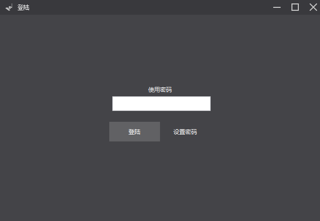

默认登陆密码: 123 

默认超级密码: makeblock321

#### 2. 选择进入界面

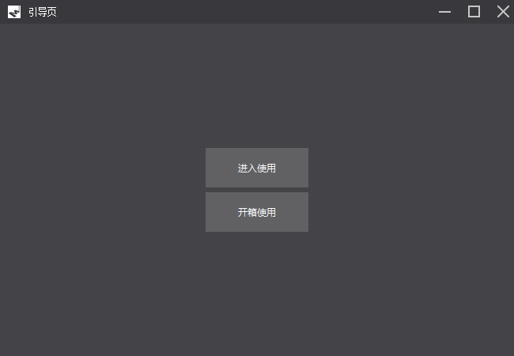

如果是第一次使用，建议点击开箱使用，按照引导流程来完成安装检测。确保安装OK，可直接单击"进入使用"

#### 3. 主要控制界面

mLaser软件提供了两种控制界面，一种简单版本，另一种高级版本。简单版本只提供默认参数打印图形。

如下是简单版本的界面

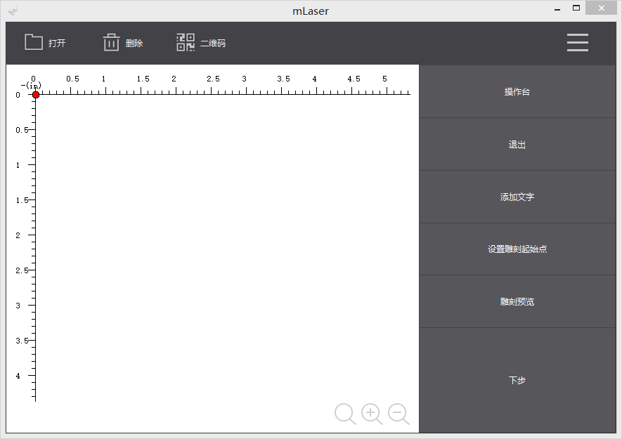

要在高级版本和简单版本界面之间进行切换，只需要找到工具下拉菜单中的界面选择，选择对应的模式既可。

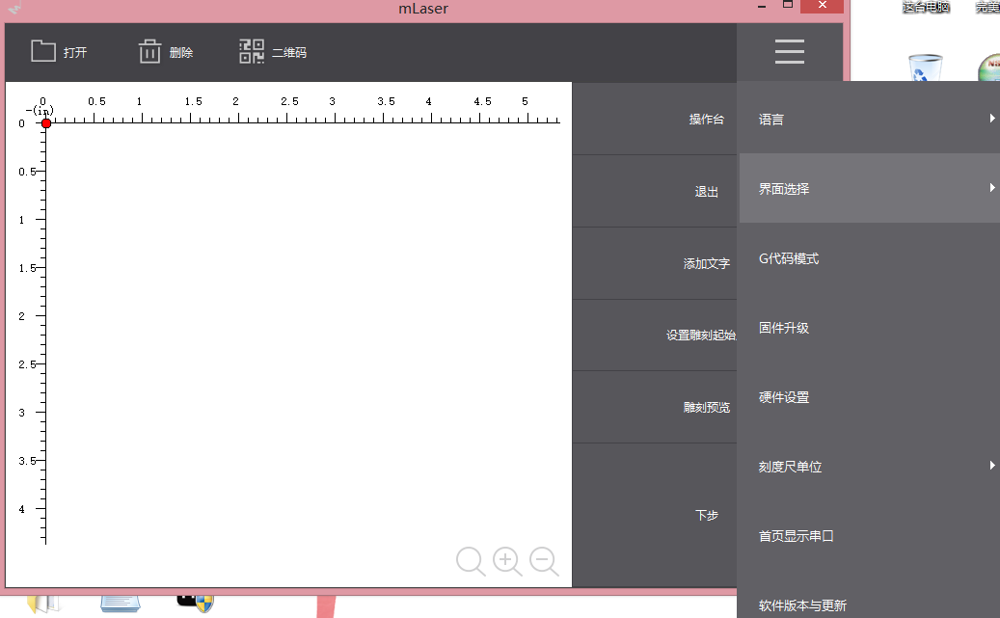

高级控制面板

注: 本说明文档完全针对高级控制版面来进行说明。

## 2.装机完成后初次使用教程

#### Step 1. 更新固件

装配好mLaser机械部分后，第一件事就是烧录固件。连接mLaser的USB口至电脑，等待系统安装好串口后(如果系统已经装有驱动，则不会提示安装)，打开软件，输入登陆密码，直接进入使用。

**A. 找到烧录固件对应菜单选项**

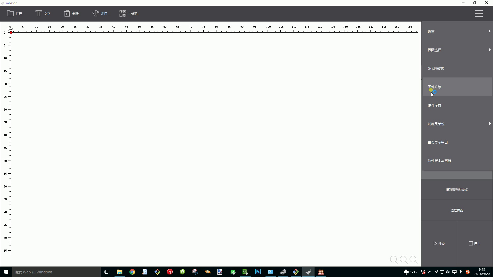

**B. 选择对应的串口**(如果电脑中有多个串口设备，需转到设备管理器中，查找板子对应的串口号)

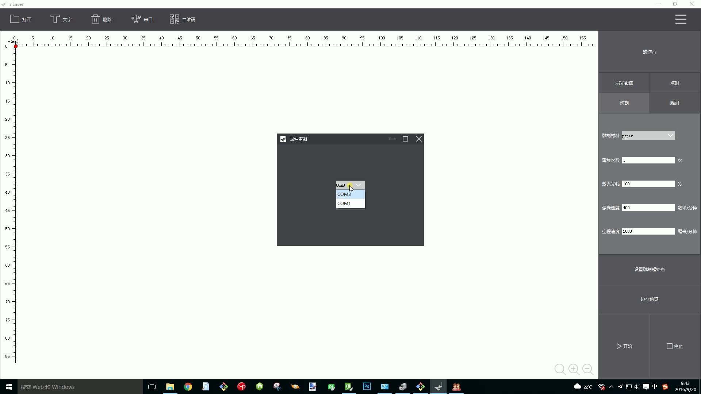

**C. 开始烧录**

此时正在烧录，可以看到megaPi正中央的蓝色led灯快速闪烁

**D. 烧录完成**

烧录完成后，将软件关闭，板子USB断开，供电断开，重启一遍。

#### Step 2. 调整焦距

**A. 在高级模式下连接好串口**

进入高级控制界面，单击 串口 ，找到megaPi主板COM端口号，单击连接。

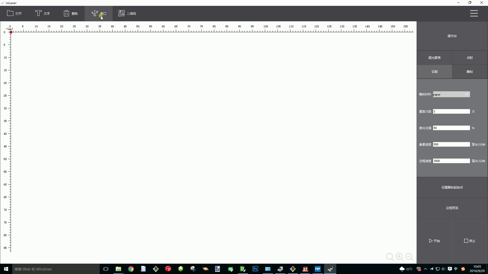

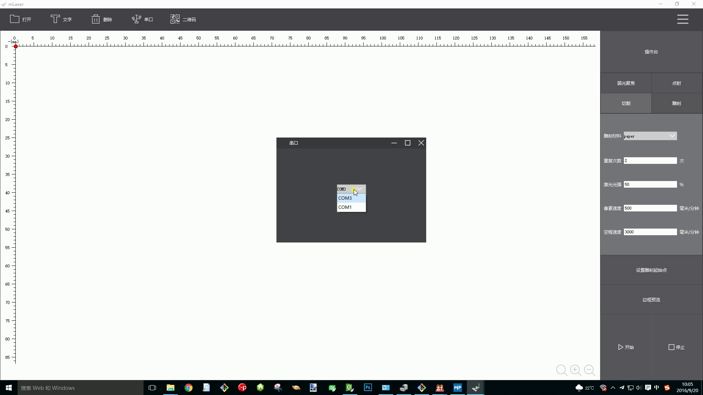

**B. 单击 弱光聚焦**

带上护目镜，单击 弱光聚焦按键，此时激光会以最小功率打开。调节激光头上的旋钮，来调节激光的焦距，使激光打在平面上的点最小，即调节完成，再次单击弱光聚焦，来关闭激光。

#### Step 3. 检查各轴及限位开关是否安装正确

确定串口正确连接，megaPi正常上电(没正常上电，风扇不转)

**A. 打开打印机控制台**

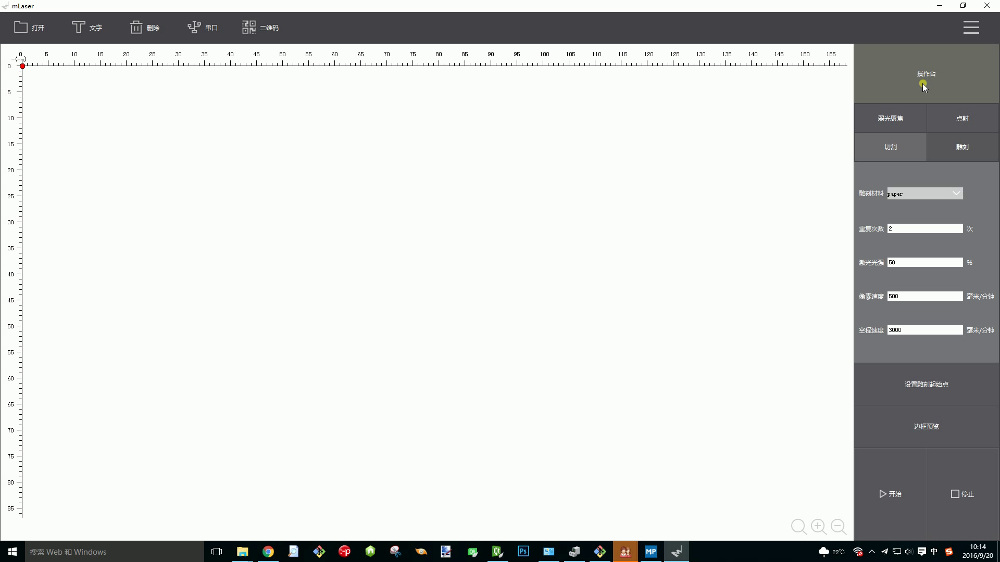

**B. 单击  复位 按键**

LaserBot执行复位动作，各个轴都会运动到限位开关原点。如果各轴不是向着限位开光方向运行，应该立即关闭电源。此外，如果XY轴到达限位开关处还未停止，也需要立即断开电源。

复位若失败，请重复检查接线是否正确。

#### Step 4. 开始你的第一次打印
开始打印前，请再次确定megaPi是否上电以及连接了电脑USB。如果您担心每次会忘记连接串口，请在菜单栏中，勾选中 "首页显示串口"

选中这个选项后，在每次打开软件，登录后，直接跳转到串口连接界面，防止您忘记连接串口。

A. 打印你的名字

在连接好串口，开启了电源，复位正常后，放置后打印木板后，你就可以开始创作了。第一个任务是用mLaser打印出你的名字。按照下面的步骤执行:

打开文字输入

选择字体和字体大小

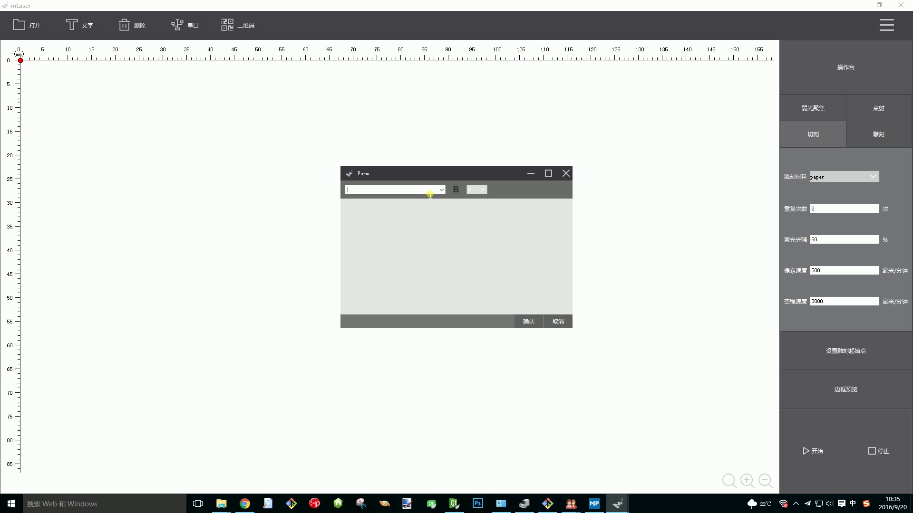

输入内容

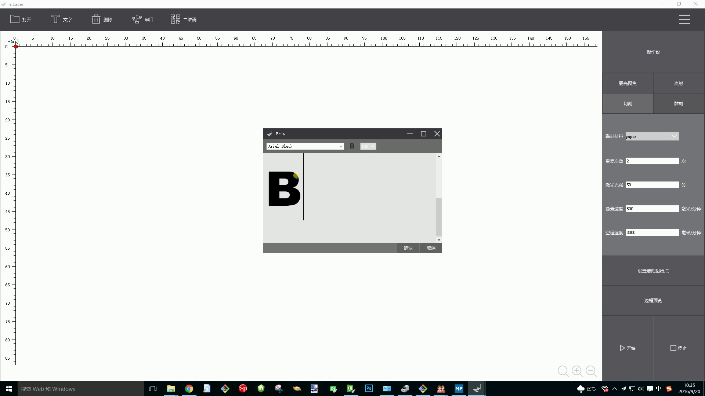

预览文字打印的边界，此时激光头会走一个矩形框，这个框是文字打印的范围

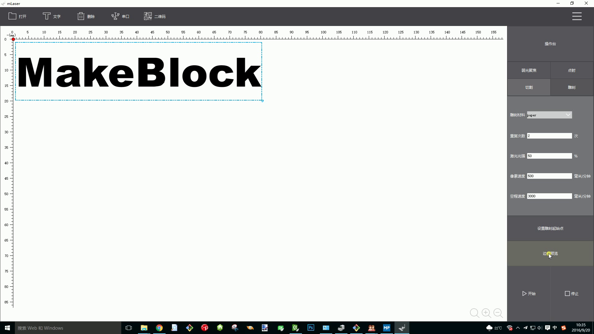

单击 开始，开始打印你的名字。

到这里位置，你成功打印除了你的名字啦，但是你发现，此时打印的名字，是只有边框效果的，如果我要打印别的效果，该怎么办？

下一步，我们来介绍。

B. 几种打印方式

mLaser提供了多种不同的烧刻方式，总体来讲，他分为两个部分: 切割打印和雕刻打印。
你可能已经观察到，上一步中，我们打印的名字是只有轮廓的，并没有填充。如果需要打印填充，那需要选择mLaser的另一种工作模式:扫描打印模式。

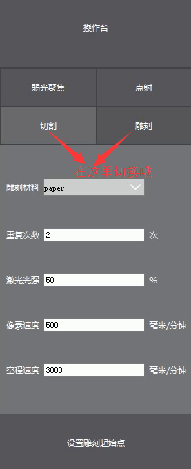

在切割模式下，所有导入的文件都是跑轮廓，这个很好理解，单是在雕刻模式下，我们采取的策略就不一样了。激光实现雕刻的方式是从图片的左上角开始，按照Z字型一行一行扫描下去。

此时，我们把参数栏切换到 雕刻 模式下，在雕刻模式下，我们看到有一个 "图片处理" 选项。这个选项下，有两个选项，黑白和灰度。这是什么意思呢？

黑白的意思就是专门处理黑白图片的效果，比如我们打印的自己的名字，他就只有黑色。任何只有黑白(没有灰度，没有任何彩色)的图片，我们都强烈建议您使用黑白模式来进行打印，不然会损失一些细节。

灰度模式的意思是专门处理有彩色，或者有灰度变化的图片。在该模式下，雕刻出来的图片将会有颜色深浅的变化。我们可以通过如下几张图来比较他们各自的应用场景。

***文字处理***
黑白处理效果

灰度处理效果

***人像处理***

原图:黑白:灰度

  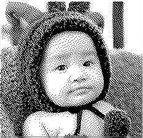

由上可以看出，如果图片中有很多的细节，则建议使用灰度打印，如果图片仅仅为黑白效果，则建议使用黑白打印。
此外，用户需要知道，svg和dxf是矢量图，目前不支持灰度雕刻。

好了，可以开始定制你自己的照片啦~

## 3. 进阶DIY极客，掌控你的LaserBot

要进一步玩好LaserBot，需要您对LaserBot中的参数有一定的了解。这一章，我们介绍LaserBot在使用过程中，要设置哪些参数，来让您更加灵活的使用他。

LaserBot分为两种工作方式，一种是切割，另一种是雕刻。在上一章中，我们已经知道了这两种方式的区别，这一章内容将对两种工作方式的参数进行详细的介绍。

- 切割
- 雕刻(灰度，黑白)

### 1. 切割

切割模式只使用一种功率来雕刻。如下参数:

- 雕刻材料: 选择不同的材料，下面会自动设定对应的参数，无需设置其他参数
- 重复次数: 切割较厚物体时，可能需要重复切割多次
- 激光光强: 激光切割时的功率光强，以百分比问单位，最大值为100%
- 像素速度: 雕刻过程中，激光开启时运动速度
- 空程速度: 雕刻过程中，激光关闭移动时的速度

### 2. 雕刻

- 图片处理: 图片处理包括两种方式，一种是处理灰度，一种是处理黑白。在前面已经介绍过如何选择这两种模式了

- 移动速度: 在雕刻模式下，所有的移动速度都是指打印空白处的速度，需要开启激光移动的地方，只是一个点，通过控制激光的光强和照射的时间，来控制一个点的深浅，从而达到灰度雕刻的效果

- 功率设置: 激光开启时设置的功率，最大为100%

- 烧刻时间: 激光烧刻一个像素点的时间，单位是毫秒

- 间隔像素: 是否间隔像素打印，等于1时每个像素都照射，等于2是间隔一个像素打印，等于3是间隔两个像素打印，依次类推

